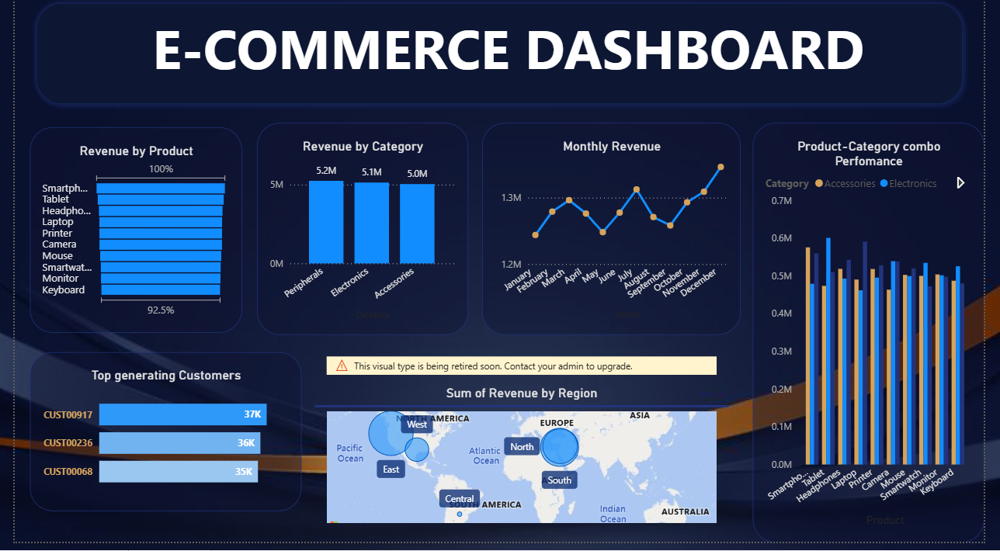

# Ecommerce_Sales_Analysis

## Project Title & Context

Analyzed 10,000+ transactions across multiple regions in 2023 to identify top revenue-generating products, understand sales trends, and highlight high-value customer segments for targeted marketing strategies.

## Problem / Objective

- Identify top revenue-generating products and categories to optimize product strategy.
- Determine monthly and seasonal sales trends across regions to guide inventory and marketing planning.
- Highlight top customers and high-value segments for targeted loyalty campaigns.
- Assess regional performance to uncover underperforming areas and growth opportunities.

## Approach / Methods

## SQL Queries

### **Revenue Analysis**

```sql
SELECT 
    Product,
    SUM(Revenue) AS TotalRevenue,
    CAST(
        100.0 * SUM(Revenue) / SUM(SUM(Revenue)) OVER ()
        AS DECIMAL(5,2)
    ) AS Product_Earnings
FROM Synthetic_Ecommerce_Sales_analyzed
GROUP BY Product
ORDER BY SUM(Revenue) DESC;
```

### Monthly **Trend Analysis**

```sql
SELECT Month(OrderDate), SUM(Revenue),  
CAST(
        100.0 * SUM(Revenue) / SUM(SUM(Revenue)) OVER ()
        AS DECIMAL(5,2)
    ) AS Monthly_earnings FROM Synthetic_Ecommerce_Sales_analyzed
GROUP BY Month(OrderDate)
ORDER BY SUM(Revenue) DESC
```

### **Customer Analysis**

```sql
--> Identification of Top customers 
SELECT TOP 10 CustomerID,COUNT(CustomerID), SUM(Revenue), CAST(
        100.0 * SUM(Revenue) / SUM(SUM(Revenue)) OVER ()
        AS DECIMAL(5,2)
    ) AS Customer_earnings FROM Synthetic_Ecommerce_Sales_analyzed
GROUP BY CustomerID
ORDER BY SUM(Revenue) DESC 

--> Identification of customer segments i.e Returning Customers
SELECT CustomerID, COUNT(CustomerID), SUM(Revenue) AS Customer_earnings FROM Synthetic_Ecommerce_Sales_analyzed
GROUP BY CustomerID
ORDER BY COUNT(CustomerID) DESC
```

### **Regional Analysis**

```sql
SELECT Region, SUM(Revenue) AS Region_earnings FROM Synthetic_Ecommerce_Sales_analyzed
GROUP BY Region
ORDER BY SUM(Revenue) DESC
```

### Product & Category Performance Analysis

```sql
--> Are certain product-category combos outperforming others?
 SELECT distinct P.Product, c.Category, SUM(P.Revenue + c.Revenue) AS Product_Category_Earnings FROM Synthetic_Ecommerce_Sales_analyzed P
 CROSS JOIN Synthetic_Ecommerce_Sales_analyzed c
 GROUP BY  P.Product, c.Category
 ORDER BY SUM(P.Revenue + c.Revenue)
```

### Excel Pivot Tables

### Power BI Dashboard



## Insights & Recommendations

### Smartphones (Category)

Lead with $1.6M (10.5% of revenue), but other categories contribute similarly (8–11%), showing a balanced portfolio. Position Smartphones as a flagship category while using bundles and promotions to lift sales across other categories.

### Peripherals (Category)

Lead at 34%, but with categories nearly tied, establishing Peripherals as a flagship category could unlock clearer growth opportunities.

### Monthly Sales

Steady at 8.07%–8.74%. Peaks in July and Q4 highlight prime cycles for marketing and inventory investment, while January’s low performance can be supported with promotions or discounts.

### Top Customers

Most high-revenue customers differ from top returners, except Customers 711 and 773. Loyalty campaigns targeting this high-value group can strengthen retention and drive revenue growth.

### Regional Revenue

East leads at 20.4%, South is lowest at 19.47%. Increase stock in the East and focus marketing in the South to stimulate growth.

### Product Bundles

Bundles including Smartphones generate the most revenue, followed by Peripherals, while Accessories lag. Focus promotions on Smartphone and Peripheral bundles, and reconsider Accessories positioning.
